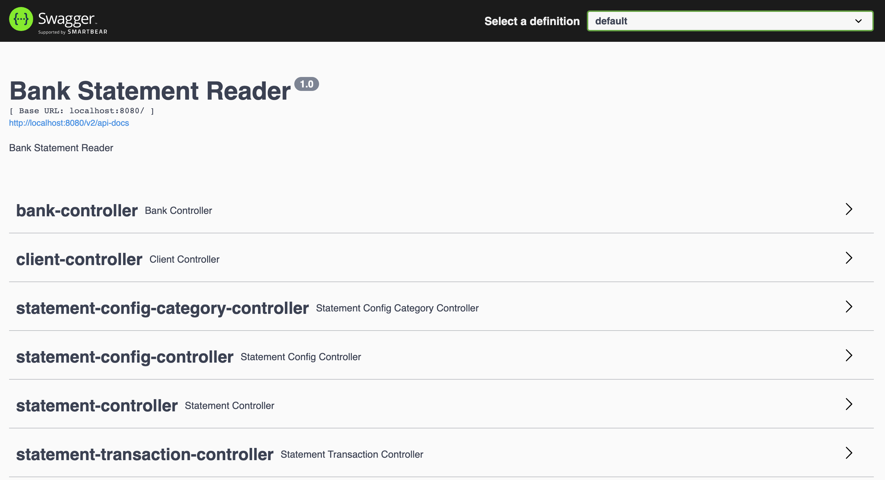

## Bank Statement Reader
The purpose of this project is to practice how to create and test a simple REST webservice.

This project uses:
 - HATEOAS Spring implementation
 - OpenCSV 
 - H2 Database
 - Springfox 3.0.0 (Swagger) -> It bugs when running with SpringBoot 2.6* and above
 - SpringBoot 2.5.13

### What does this project do?
- Reads banking transactions from a CSV file, 
- Categorizes the transactions based on pre-defined configuration
- Summarizes the categories

## How to build and run
The project can be compiled with JDK 11 and above `javac`.

To compile just do `mvn clean package`.

To run the application execute the following:

```
java -jar target/bank-statement-reader*.jar
```

The server will start at http://localhost:8080.

## REST APIs
You can also use the Swagger-UI to test the application.
http://localhost:8080/swagger-ui/



The application contains the following REST APIs

```
Bank
    GET    api/v1/banks      - Get All Banks
    GET    api/v1/banks/{id} - Get a Bank by ID
    PUT    api/v1/banks{id}  - Update a Bank
    POST   api/v1/banks      - Create a Bank
    DELETE api/v1/banks/{id} - Delete a Bank

Client
    GET    api/v1/clients      - Get All Clients
    GET    api/v1/clients/{id} - Get a Client by ID
    PUT    api/v1/clients/{id} - Update a Client
    POST   api/v1/clients      - Create a Client
    DELETE api/v1/clients/{id} - Delete a Client

Statement
    GET    api/v1/statements?clientId={clientId} - Get All Banking Statements by ClientID
    GET    api/v1/statements/{Id}                - Get a Banking Statements by ID
    POST   api/v1/statements/upload              - Upload a CSV file for a Client and a Bank
    DELETE api/v1/statements/{Id}                - Delete a Banking Statement

Statement Transaction
    GET    api/v1/statements/{statementId}                   - Get All Transactions of a Banking Statement
    GET    api/v1/statements/{statementId}/transactions/{Id} - Get a Transaction by ID

Configuration
    GET    api/v1/configurations?clientId={clientId} - Get All Statement Configurations by ClientID
    GET    api/v1/configurations/{id}                - Get a Statement Configuration by ID
    PUT    api/v1/configurations/{id}                - Update a Statement Configuration
    POST   api/v1/configurations                     - Create a Statement Configuration
    DELETE api/v1/configurations/{id}                - Delete a Statement Configuration

Configuration Category
    GET    api/v1/configurations/{configId}/categories      - Get All Categories by ConfigurationID
    GET    api/v1/configurations/{configId}/categories/{id} - Get a Statement Configuration by ID
    PUT    api/v1/configurations/{configId}/categories/{id} - Update a Statement Configuration
    POST   api/v1/configurations/{configId}/categories      - Create a Statement Configuration
    DELETE api/v1/configurations/{configId}/categories/{id} - Delete a Statement Configuration
```
## Statement CVS File Sample

````
"Data","Dependencia Origem","Histórico","Data do Balancete","Número do documento","Valor",
"28/10/2020","","Saldo Anterior","","0","20750.31",
"05/11/2020","","Benefício INSS","","196324558","59397.51",
````

## Statement Configuration Sample
Configuration Categories are appended.
```
{
    "id": 1,
    "clientId": 1,
    "bankId": 1,
    "descriptionField": "Histórico",
    "documentIdField": "Número do documento",
    "transactionDateField": "Data",
    "transactionValueField": "Valor",
    "categories": [
        {
            "id": 1,
            "name": "income",
            "tags": "Benefício, Cr�dito em conta",
            "_links": {
                "self": {
                    "href": "http://localhost:8080/api/v1/configurations/1/categories/1"
                }
            }
        }`
    ],
    "_links": {
        "self": {
            "href": "http://localhost:8080/api/v1/configurations/1"
        }
    }
}
```
## Statement Sample
Transactions are appended.
```
{
    "id": 1,
    "clientId": 1,
    "bankId": 1,
    "transactions": [
        {
            "id": 1,
            "transactionDate": "28/10/2020",
            "description": "Saldo Anterior",
            "transactionValue": 20750.31,
            "documentId": "0",
            "_links": {
                "self": {
                    "href": "http://localhost:8080/api/v1/statements/1/transactions/1"
                }
            }
        },
        {
            "id": 2,
            "transactionDate": "05/11/2020",
            "description": "Benef�cio INSS",
            "transactionValue": 59397.51,
            "documentId": "196324558",
            "category": "income",
            "_links": {
                "self": {
                    "href": "http://localhost:8080/api/v1/statements/1/transactions/2"
                }
            }
        }
    ],
    "_links": {
        "self": {
            "href": "http://localhost:8080/api/v1/statements/1"
        }
    }
}
```